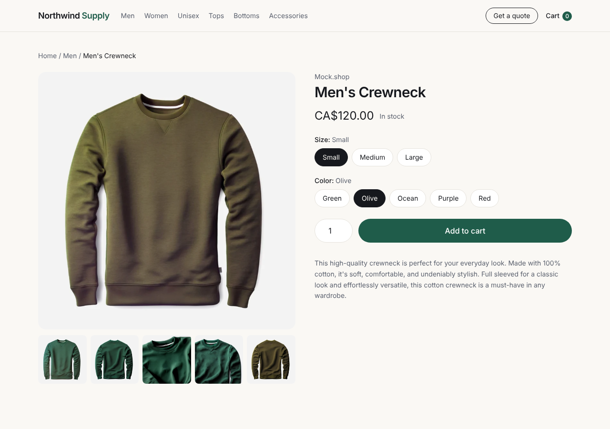
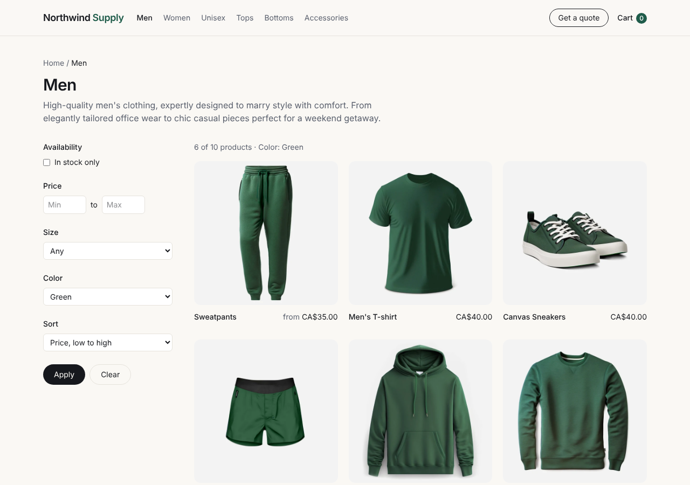
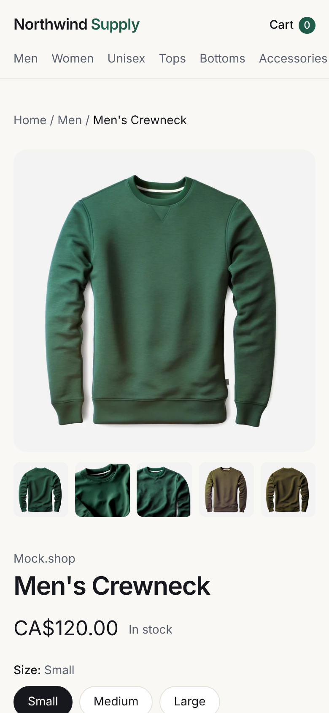

# headless-shopify-ssr-demo

A headless Shopify storefront on **TanStack Start**, where every page is rendered on the
server. Products, prices, variants and collection filters are already in the HTML the
server sends, so customers, Google and AI crawlers see the full page even with
JavaScript disabled. Cart and checkout use Shopify's Storefront Cart API and hand off
to Shopify's own checkout, so the store's payment setup applies unchanged.

It runs against Shopify's public demo catalogue (mock.shop) out of the box, and against
any real store by setting two environment variables.



## What is in it

| Route | What it shows |
|---|---|
| `/` | Featured products and collections, Organization schema |
| `/collections/$handle` | Product grid with filters (availability, price range, any product option such as size, colour or capacity) and sorting. Filters are a plain `GET` form, so every filtered view has its own server-rendered, shareable URL. BreadcrumbList and ItemList schema |
| `/products/$handle` | Gallery, price, stock, variant picker, add to cart. The selected variant is in the URL (`?variant=…`), each option value is a real link, and the page includes `ProductGroup` schema with one `Offer` per variant |
| `/cart` | Lines, quantity update, remove, subtotal, hand-off to `cart.checkoutUrl` |
| `/quote` | Quote request form with server-side validation (no integration yet) |
| `/sitemap.xml`, `/robots.txt` | Generated from the store's products and collections |

## How the content is visible without JavaScript

1. **Data loads on the server.** Each route's `loader` calls a server function
   (`src/lib/server.ts`) that queries the Storefront API. During server rendering the
   result is written straight into the HTML.
2. **State lives in the URL.** Filters, sort order and the selected variant are search
   parameters, not client state. Any of those views can be requested directly and is
   rendered in full on the server.
3. **Forms post to the server.** Add to cart, quantity changes and the quote form are
   normal HTML forms posting to server routes (`src/routes/api/*`), which redirect back.
   With JavaScript enabled the app behaves as a fast single-page app; without it, the same
   pages still work.
4. **Structured data and meta tags are server-rendered** through each route's `head()`:
   title, description, canonical, Open Graph and JSON-LD.

### Proof

Raw HTML from the server for a product page with a variant selected (no browser, no JavaScript):

```
$ curl -s "http://localhost:3000/products/men-crewneck?variant=43695848128534"
<title>Men's Crewneck | Northwind Supply</title>
<h1 class="mt-1 text-3xl font-semibold tracking-tight">Men's Crewneck</h1>
CA$120.00
rel="canonical" href="http://localhost:3000/products/men-crewneck"
"@type":"ProductGroup"
```

A filtered, sorted collection page (`?opt.Color=Green&sort=price-asc`) returns the
matching products already in the HTML:

```
$ curl -s "http://localhost:3000/collections/men?opt.Color=Green&sort=price-asc"
<h3 class="text-sm font-medium">Sweatpants</h3>
<h3 class="text-sm font-medium">Men's T-shirt</h3>
<h3 class="text-sm font-medium">Canvas Sneakers</h3>
```

The cart works without JavaScript too: posting the add-to-cart form returns `303` to
`/cart`, sets an `HttpOnly` cart cookie, and the cart page renders the line and the
Shopify checkout link on the server.

## Screenshots

| Filtered collection | Product (mobile) |
|---|---|
|  |  |

## Run it

Needs Node 22+.

```bash
npm install
npm run dev        # http://localhost:3000
npm test           # filter, variant-selection and form-validation tests
npm run typecheck
npm run build && npm run preview
```

### Point it at a real store

Copy `.env.example` to `.env`:

```
SHOPIFY_STORE_DOMAIN=your-store.myshopify.com
SHOPIFY_STOREFRONT_TOKEN=<public Storefront API token>
SITE_URL=https://www.your-domain.com
```

The Storefront token is the public one meant for storefronts; it is only used on the
server here anyway.

## Notes for a production store

- **Filtering.** The demo catalogue has no Search & Discovery filters configured, so
  `applyFilters` (`src/lib/catalog.ts`) filters on the server after fetching the
  collection. On a store with Search & Discovery set up, pass the same URL parameters
  to the Storefront API's `products(filters: …)` instead, which also pages beyond 100
  products.
- **Variants as options.** Options such as capacity, colour or pipe package map directly
  to Shopify product options; the picker and filters are generic over option names.
- **Checkout.** The cart hands off to Shopify checkout, so payment methods configured in
  Shopify (for example Klarna with manual capture) are used as they are.
- **Caching.** Product and collection queries are good candidates for short-lived edge
  caching keyed on the URL; the cart is per-user and never cached.

## Stack

TanStack Start (React 19, TanStack Router), Vite, TypeScript (strict), Tailwind CSS,
Shopify Storefront API (GraphQL), Vitest.

## License

MIT
